# Signals & Systems: Sampling
This assignment explores the effects of sampling on signals in the time and frequency domain. It involves using both theory and software to see the effects of sampling.

## Section 1: Plots of the Sampled Signals
Sampled signals can be shown as: 

$$\begin{align} 

y_{i}[n] &= x_{i}(nT_{s})

\end{align}$$ 

where 

$$\begin{align} 

T_{s} &= 1/F_{s} 

\end{align}$$

Since the eight signals given to me to sample are just three different signals at different sampling frequencies, the three signals that were sampled are:

$$\begin{align}

x_{0} &= \cos(2\pi10kHz*t) \\
x_{1} &= \sin(2\pi10kHz*t) \\
x_{2} &= \cos(2\pi10kHz*t+45\degree) \\

\end{align}$$

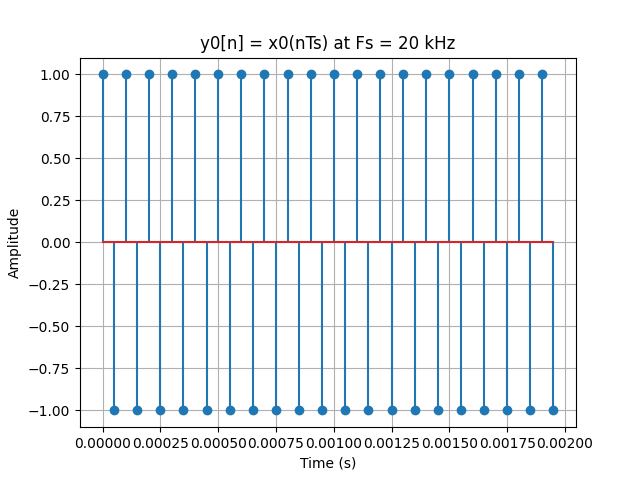
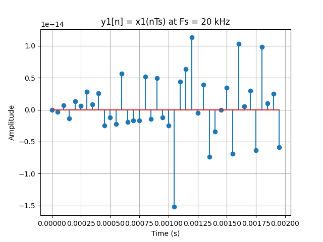
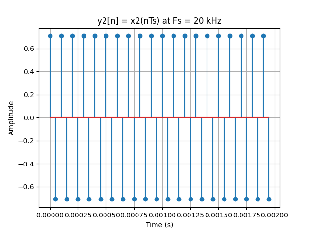
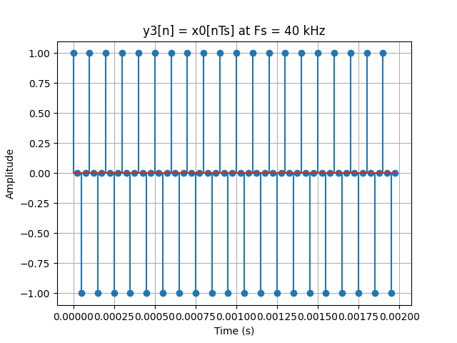
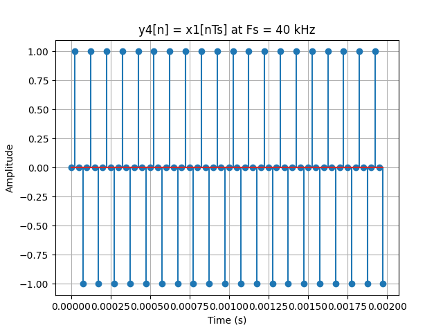
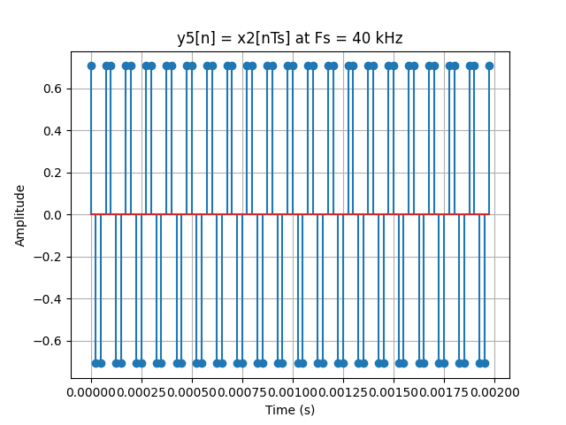
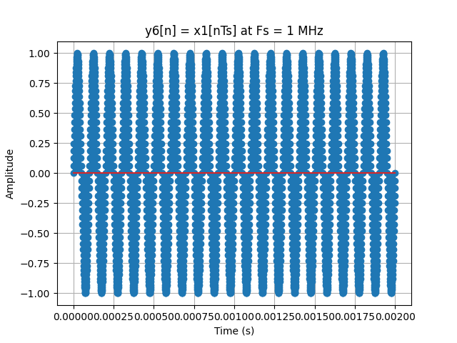
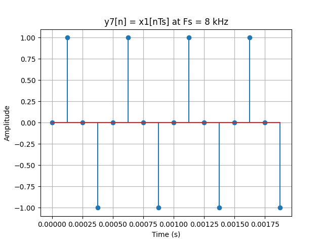

### Magnitude and Phase of a Few Signals

The magnitude and phase spectra for signals $y_{i}[n]$ for $i \in{0, 5, 6, 7}$ are shown below:

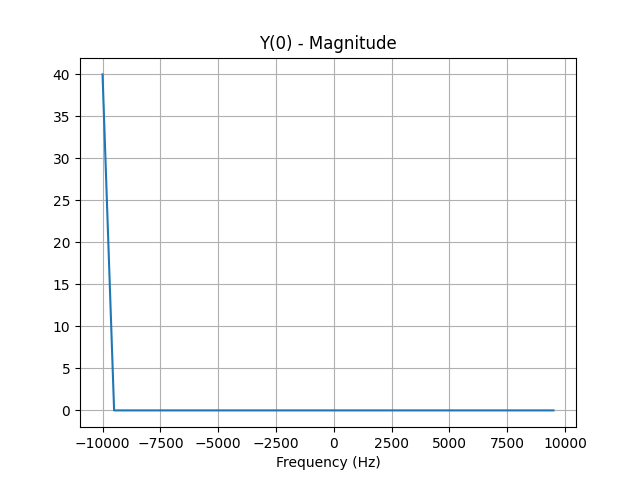
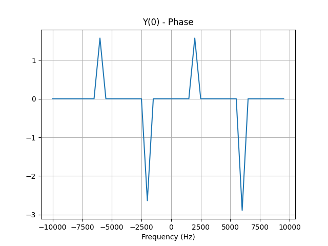
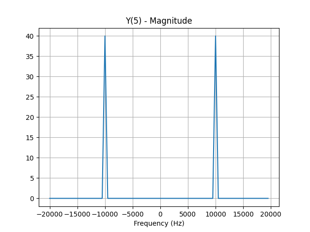
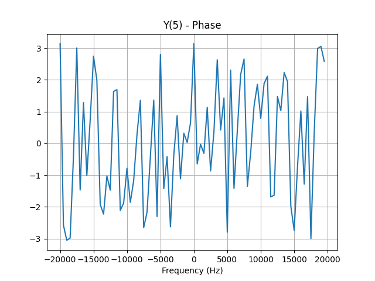
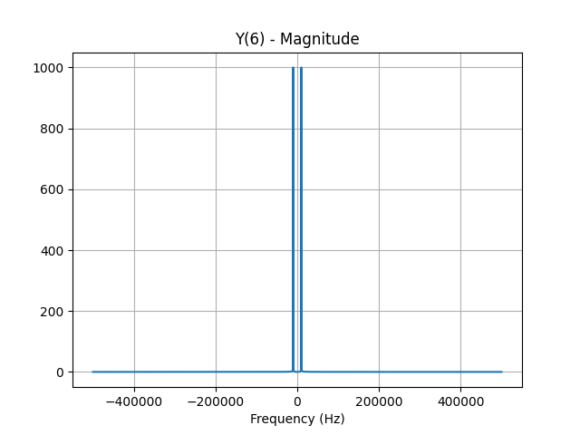
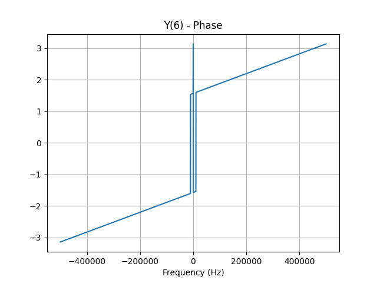
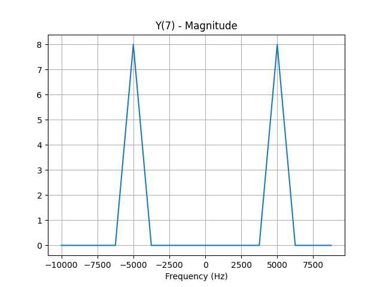
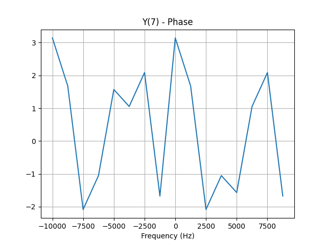

## Section 2: Relating the Plots to Nyquist Sampling Theorem

The Nyquist Sampling Theorem states

$$\begin{align} 

F_{s} &> 2f_{max} 

\end{align}$$

With the signals at a 10 kHz frequency:

- The signals sampled at 20 kHz ($F_{s} = 20kHz$) are **exactly Nyquist**, which still works but phase and amplitude may look odd.
- The signals sampled at 40 kHz ($F_{s} = 40kHz$) are **oversampled** and will give a clean sinusoid shape.
- The signal sampled at 8 kHz ($F_{s} = 8kHz$) are **below Nyquist** and aliasing occurs.
- The signal sampled at 1 MHz ($F_{s} = 1MHz$) are **heavily oversampled** and will look continuous.

## Section 3: The Signal $x_{8}(t)$

The signal $x_{8}(t)$ is defined as:

$$\begin{align} 

x_{8}(t) &= 2e^{-100t}\sin(2000t)u(t) 

\end{align}$$

### Deriving the Magnitude Spectrum:

We begin by using the trigometric identity $\sin\theta = \frac{e^{j\theta} - e^{-j\theta}}{2j}$

$$\begin{align*}

\sin(2000t) &= \frac{e^{j2000t} - e^{-j2000t}}{2j}

\end{align*}$$

So,

$$\begin{align*}

x_{8}(t) &= \frac{2}{2j}e^{-100t}(e^{j2000t} - e^{-j2000t})u(t) \\
x_{8}(t) &= \frac{1}{j}(e^{-(100 - j2000)t} - e^{-(100 + j2000)t})u(t)

\end{align*}$$

The Fourier transform property of $e^{-at}u(t)$ is:

$$\begin{align*}

\frac{1}{a + j\omega}

\end{align*}$$

So the tranformed signal is:

$$\begin{align}

X_{8}(\omega) &= \frac{1}{j}(\frac{1}{100 - j(2000 - \omega)} - \frac{1}{100 + j(2000 + \omega)})

\end{align}$$

### The Plots of $X_{8}(\omega)$

Here we will compare the magnitude plots of an FFT-based approximation of $x_{8}(t)$ V.S. what was just derived as equation (8).

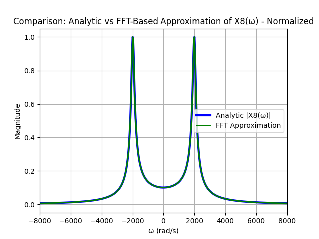

I used a 1 MHz sampling rate because $f_{0}$ of the signal can be acquired by converting radians to Hertz like so:

$$\begin{align*}

\sin(\omega t) &= \sin(2000t) \\
\omega &= 2000 \\
f = \frac{\omega}{2\pi} = \frac{2000}{2\pi} &= 318.31 Hz

\end{align*}$$

**Why I chose the sampling frequency I did**

I needed to choose a sampling frequency that oversampled the signal according to equation (6) in order for it to look continuous.

**Why I chose the duration I did**

I chose a duration of 200 milliseconds because the signal was very slow, so I needed a long time window to sample the amount I wanted to sample.